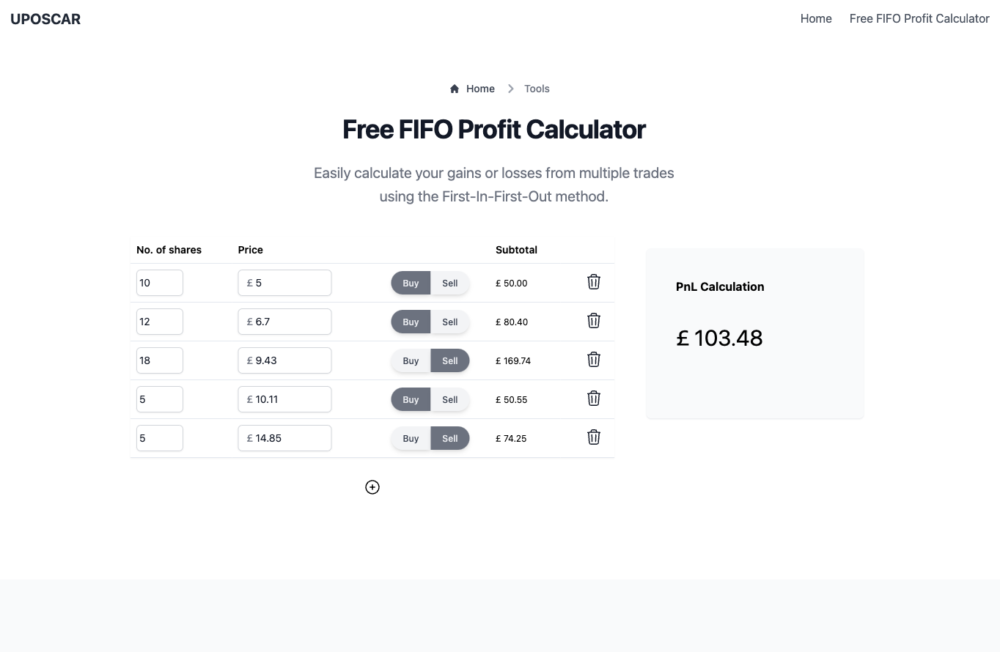

# Hi there 👋

I am Gemma, a senior full-stack software engineer with 12 years experience who has helped teams develop products and software quickly, laying the groundwork that resulted in **20+ services deployed to production** @ [Kamma](https://kammadata.com) in 6 years, and led the delivery of features and releases to over 30+ live in-person event websites with a team of 3 @ WTG within 3 years.

My goal isn't just to produce software, but to:

1. Help teams achieve **optimal product velocity** by improving the developer experience.
2. **Build products** that customers need and are easy to use.
3. **Increase internal productivity** through collaboration, and building/sourcing tools.

I love working with different languages, frameworks and tools across the entire stack including:

## Highlights

**What am I up to?**

- I recently designed and built version 1 of [Uposcar](#uposcar), a simple free profit/loss calculator for those using the FIFO accounting method.
- I'm currently working on [Melimundo](#melimundo), a visa application assistant for UK citizens looking to live and work in Spain as digital nomads.
- I'm currently deep-diving into [Bun](https://bun.sh).
- I'm looking forward to either learning Solidity or Rust.

**Writing Highlights**

- 🔥📈 My most engaged article: **[“16 Principles for Tech-led Start-ups as a Software Engineer”](https://dev.to/gemmablack/16-principles-for-tech-led-start-ups-as-software-engineer-5gjk)** on Dev.to.
- ⚡💬 My most controversial article: **[“NodeJS: 4.8x Faster if You go Back to Callbacks!”](https://hackernoon.com/nodejs-48x-faster-if-you-go-back-to-callbacks)** on Hackernoon.
- ⏱️🔍My fastest syndicated article: **[“NodeJS: We can run tests natively!”](https://gemmablack.dev/nodejs-we-can-run-tests-natively)** for **[“Software Testing Weekly #207”](https://softwaretestingweekly.com/issues/207)**. 

## To contact me

Ping me a message on Twitter [@GemmaBlackUK](https://x.com/GemmaBlackUK).

**Outside of work**

## Apps in the wild

### Uposcar

[uposcar.com](https://uposcar.com) - A frameworkless, free FIFO profit and loss calculator.

                  

### Melimundo

[melimundo.com](https://melimundo.com) – A free Digital Nomad Visa applications assistance for UK expats moving to Spain.

## Fun Facts

If you're still reading my profile, I've somewhat managed to come across as remotely interesting.

- I use Plain Text Accounting for simplicity. Kudos to [hledger](https://hledger.org/).
- 🇪🇸 I decided to move to the heart of Spain where no one speaks English. I can attest that my Spanish is improving.
- 🔨 I'm renovating some beech-wood chairs that I was given for free.
- 🎹 I love making music on my phone and once upon a time released loops to practice my production skills @ [Roxxibox Loop](https://www.youtube.com/@RoxxiboxLoop).
- 👩🏽‍💻 I created a Tailwind analog called [Preons](https://github.com/preons/preons) before I knew it existed, after realizing how useful functional CSS was and needing more flexibility than what [Tachyons](https://tachyons.io/) provided.